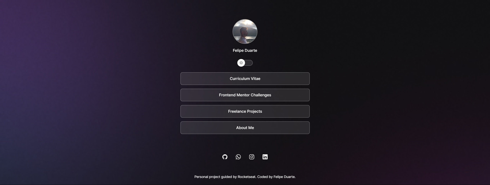

<h1 align="center"> Portfolio </h1>

This is my first project, promoted and guided by Rocketseat for teaching WEB technologies.  
<a href="https://lp.rocketseat.com.br/devlinks/inscricao?utm_source=github&utm_medium=descricao&utm_campaign=capture-devlinks&utm_term=organic&utm_content=descricao-github-mayk-brito">Study this project in video format by clicking here (Portuguese Language).</a>

  <a href="#-tecnologias">Technologies</a>&nbsp;&nbsp;&nbsp;|&nbsp;&nbsp;&nbsp;
  <a href="#-projeto">Project</a>&nbsp;&nbsp;&nbsp;|&nbsp;&nbsp;&nbsp;
  <a href="#-layout">Layout</a>&nbsp;&nbsp;&nbsp;|&nbsp;&nbsp;&nbsp;
  <a href="#memo-licença">License</a>

  

 

  

## 🚀 Technologies

This project was developed with the following technologies:

- HTML and CSS
- JavaScript
- Git and Github
- Figma

## 💻 Project

I searched for a free web development course on march, 2023. i was afraid it wouldnt workout because its a whole new area that i never touched. Gladly i finished the course in one week and i had a solid material that gave me motivation and faith in changing carrer. So, this linktree was created to use as business card and portfolio which i intend to update with every new skill that this next phase of my life provides.

## 🔖 Layout

You can preview the project default layout through [this link](https://www.figma.com/community/file/1187422022288947321). It is necessary to have an account on
[Figma](https://figma.com) to acess.

## :memo: Licença

This project is licensed under the MIT.

## To do list

- Add links in the lists
- Update profile photos
- Switch button to change languages
- Change README image

---

Personal project guided by Rocketseat [Join our community!](https://discord.gg/rocketseat)
